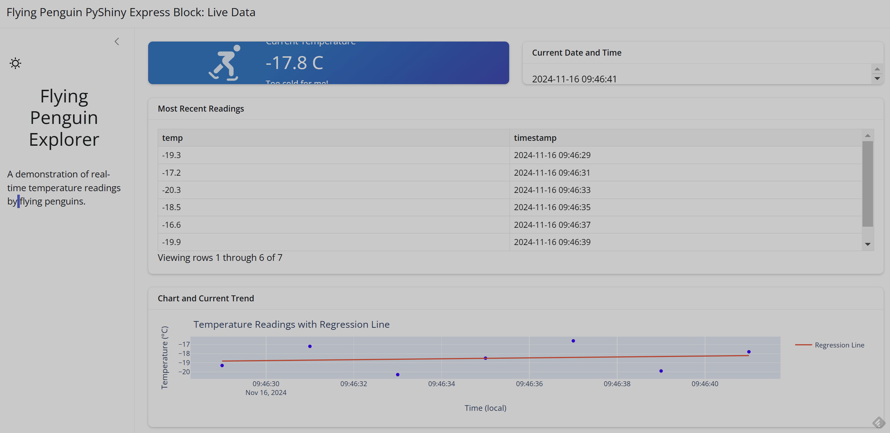

# cintel-05-cintel-
Module 5 Project for Continuous Intelligence

## Built locally in repository MS in Data Analytics> cd cintel-05-cintel-

---------------------
## Description
---------------------
This dashboard presents the most recent readings from a random number generator simulating temperature data.

---------------------
## Installation Instructions
---------------------
Activate virual environment with:
.venv\Scripts\activate
-
Install requirements with:
pip install -r requirements.txt

---------------------
## Usage
---------------------
Change the input slider to adjust the frequency of temperature reading updates (in seconds)
The other slider adjusts the number of data points plotted on the scatterplot at the bottom of the page.

---------------------
## Features
---------------------
Dark mode may be activated (or deactivated) with the icon at the top left of the sidebar.
Current readings are available in boxes at the top.
A table of recent readings is logged in the middle, holding only the most recent 60 readings.
The data from this table is displayed in the chart at the bottom with a regression line.
Charts can be expanded to full screen by clicking the icon that appears at the bottom right when you hover over the chart.

---------------------
## Example Screenshots
---------------------

---------------------
## Acknowledgements
---------------------
This project was built under the guidance of Dr. Denise Case (https://github.com/denisecase) for Continuous Intelligence and Interactive Analytics - CSIS 44630.
Built with Shiny for Python.

---------------------
## Contact Information
---------------------
https://github.com/matthewpblock